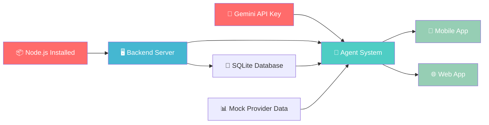

# 🔍 Bottlenecks, Prerequisites & Risk Analysis

## 1. API Key — The #1 Blocker

### Recommended: Google AI Studio (NOT Google Cloud)

| Option | Setup Time | Cost | Best For |
|--------|-----------|------|----------|
| **🟢 Google AI Studio** | 2 minutes | **Free** (rate-limited) | ✅ Our hackathon |
| 🟡 Google Cloud Vertex AI | 30-60 min | $300 free credit | Enterprise apps |

> [!IMPORTANT]
> **Go with Google AI Studio.** It's instant, free, and gives us everything we need.
> 
> **Steps:**
> 1. Go to [aistudio.google.com/apikey](https://aistudio.google.com/apikey)
> 2. Sign in with your Google/Gmail account
> 3. Click "Create API Key"
> 4. Copy the key — done ✅
>
> No billing setup, no credit card, no Google Cloud project needed.

### Free Tier Limits (Gemini 2.0 Flash)

| Limit | Value | Impact on Us |
|-------|-------|-------------|
| Requests/min | 15 RPM | ⚠️ Could be tight during demo — we'll add caching |
| Tokens/min | 1,000,000 | ✅ More than enough |
| Requests/day | 1,500 RPD | ✅ Plenty for 4 days of dev + demo |

> [!TIP]
> If 15 RPM feels limiting during demo, we can upgrade to **pay-as-you-go** in AI Studio (no Google Cloud needed). Gemini 2.0 Flash costs ~$0.10/million tokens — essentially free.

---

## 2. Complete Bottleneck Analysis

### 🔴 Critical Blockers (Must resolve before coding)

| # | Bottleneck | Risk | Solution | Owner Action |
|---|-----------|------|----------|-------------|
| 1 | **No Gemini API Key** | Can't build any agent | Get from AI Studio (2 min) | **YOU — do this first** |
| 2 | **Node.js not installed?** | Can't run backend | Install from nodejs.org | Check: run `node --version` |
| 3 | **No Android phone for Expo Go?** | Can't test mobile app | Use Expo web preview OR emulator | We'll handle either way |

### 🟡 Medium Risks (Have workarounds)

| # | Bottleneck | Risk | Workaround |
|---|-----------|------|-----------|
| 4 | **Urdu/Roman Urdu parsing accuracy** | Gemini may confuse Urdu with Hindi | Strong system prompts + explicit language instructions |
| 5 | **Google Maps API (optional)** | Need billing for real Places data | We use **mock dataset** — no Maps API needed |
| 6 | **Expo Go limitations** | Some native features restricted | We only use basic UI components — no native deps |
| 7 | **15 RPM rate limit** | Could throttle during live demo | Response caching + graceful fallback messages |

### 🟢 Low Risks (Already mitigated by design)

| # | Item | Why It's Fine |
|---|------|--------------|
| 8 | Database setup | SQLite = zero config, just `npm install` |
| 9 | Multi-agent complexity | Each agent is a single function — modular & testable |
| 10 | Demo recording | Antigravity has built-in browser recording |
| 11 | Time (4 days) | Very generous — core system is ~8-10 hours of coding |

---

## 3. Environment Prerequisites Checklist

Run these checks on your machine before we start:

```powershell
# Check Node.js (need v18+)
node --version

# Check npm
npm --version

# Check git
git --version
```

### What You Need Installed

| Tool | Required? | How to Get |
|------|----------|-----------|
| **Node.js 18+** | ✅ Yes | [nodejs.org](https://nodejs.org) (LTS version) |
| **npm** | ✅ Yes | Comes with Node.js |
| **Git** | ✅ Yes | [git-scm.com](https://git-scm.com) |
| **Expo Go app** | ✅ For mobile | Install from Play Store / App Store on your phone |
| **Android Studio** | ❌ Not needed | Expo Go on physical phone is sufficient |
| **Google Cloud SDK** | ❌ Not needed | We use AI Studio, not Vertex AI |
| **Python** | ❌ Not needed | Everything is Node.js |

---

## 4. Accounts & Keys Needed

| Account/Key | Purpose | How to Get | Status |
|------------|---------|-----------|--------|
| **Gemini API Key** | Core LLM for all agents | [aistudio.google.com/apikey](https://aistudio.google.com/apikey) | ❌ Need this |
| Google Maps API Key | Provider discovery (optional) | Google Cloud Console | ⏭️ Skip — using mock data |
| Expo Account | Building APK for demo | [expo.dev](https://expo.dev) | Optional — Expo Go works without it |

---

## 5. Technical Decisions to Confirm

### Q1: Mobile-First or Web-First?
**Recommendation: Build both simultaneously.**
- The backend API is shared — same `/api/chat` endpoint
- Mobile = React Native Expo (required by challenge)
- Web = Simple HTML/CSS/JS chat interface (easy to add, impresses judges)

### Q2: Mock Data vs Real APIs?
**Recommendation: 100% Mock Data.**
- Challenge explicitly allows it: *"Use mock data if real APIs are unavailable"*
- Eliminates Google Cloud billing setup
- We control the data = perfect demos every time
- Our mock dataset will have 50+ realistic providers across Islamabad

### Q3: SQLite vs In-Memory?
**Recommendation: SQLite.**
- Persistent bookings survive server restarts
- Judges can see the database file as proof of "real" state changes
- Zero config — just `npm install better-sqlite3`

### Q4: Single Gemini call vs Multiple agent calls?
**Recommendation: Multiple calls (one per agent).**
- More expensive in API calls but demonstrates **true agentic behavior**
- Each agent has its own system prompt + tools
- Generates detailed trace logs (major scoring criterion)
- Judges see 5 distinct reasoning steps, not one blob

---

## 6. Four-Day Execution Schedule

### Day 1 (Today) — Foundation
| Time Block | Task | Deliverable |
|-----------|------|-------------|
| Hour 1 | Get API key + verify environment | `.env` with working key |
| Hour 2-3 | Backend scaffold + mock provider dataset | Express server + 50 providers JSON |
| Hour 4-5 | SQLite schemas + database layer | Working DB with CRUD operations |
| Hour 6 | Expo mobile app initialization | Running Expo app with basic navigation |
| **EOD** | **Server starts, DB works, app opens** | |

### Day 2 — Agent Core
| Time Block | Task | Deliverable |
|-----------|------|-------------|
| Hour 1-2 | Intent Agent + Discovery Agent | Parse input → find providers |
| Hour 3-4 | Matching Agent + Booking Agent | Score → book → confirm |
| Hour 5 | Follow-Up Agent + Orchestrator | Full pipeline working |
| Hour 6 | Agent trace logging system | Complete logs for every request |
| **EOD** | **Full agent pipeline working via API** | |

### Day 3 — Mobile App + Web
| Time Block | Task | Deliverable |
|-----------|------|-------------|
| Hour 1-3 | Chat UI (WhatsApp-style) | Beautiful, functional chat screen |
| Hour 4 | Provider cards + booking confirmation | Rich UI components |
| Hour 5 | Agent trace viewer | Users can see AI reasoning |
| Hour 6 | Web dashboard (bonus) | Simple web chat interface |
| **EOD** | **Complete working prototype** | |

### Day 4 — Polish + Demo
| Time Block | Task | Deliverable |
|-----------|------|-------------|
| Hour 1-2 | Edge cases + error handling | Robust system |
| Hour 3 | README documentation | Architecture, APIs, setup guide |
| Hour 4 | Demo video recording (3-5 min) | Polished walkthrough |
| Hour 5 | Final testing + bug fixes | Production-ready |
| **EOD** | **Submission-ready project** | |

---

## 7. Key Dependencies Map



**Critical Path:** API Key → Backend → Agents → Mobile/Web

---

## 8. Action Items (Before We Start Coding)

- [ ] **Get Gemini API Key** from [aistudio.google.com/apikey](https://aistudio.google.com/apikey)
- [ ] **Verify Node.js** is installed (`node --version` — need v18+)
- [ ] **Verify npm** is installed (`npm --version`)
- [ ] **Install Expo Go** on your phone (Play Store / App Store)
- [ ] **Confirm you're ready** — then I'll start building immediately
