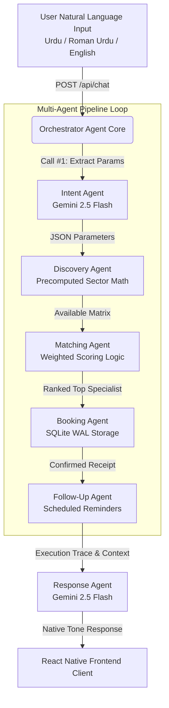

# KaamConnect AI Orchestrator — Hackathon Demonstrator Walkthrough

Welcome to the complete production-grade implementation walkthrough of the **KaamConnect AI Orchestrator** developed for the Google Hackathon 2026. This document acts as your comprehensive guide to demonstrating the prototype to judges, reviewing technical decisions, and understanding the autonomous multi-agent lifecycle.

---

## 🏛️ End-to-End System Architecture

The solution operates entirely on a **$0 budget/Free Tier Stack**, combining lightweight deterministic routing with targeted state-of-the-art LLM functional reasoning. 



---

## 💻 Technical Stack & $0 Budget Strategy

To fulfill the strict performance and financial constraints of the informal service economy demonstrator, we utilized specific optimizations:

| Component | Technology | $0 Strategy & Design Decision |
| :--- | :--- | :--- |
| **LLM Reasoning** | Gemini 2.5 Flash (`@google/genai`) | Leverages **AI Studio Free Tier** for lightning-fast structured function outputs. |
| **Rate Limit Guard** | Local memory cache engine | Caches duplicate intents/inputs to stay below the Free Tier limit of **15 RPM**. |
| **Geocoding & Maps** | Precomputed Haversine Matrix | Eliminates expensive Google Maps API billing by storing static coordinates for **30+ Islamabad sectors**. |
| **Database Layer** | `better-sqlite3` (WAL Mode) | Serverless, ultra-fast disk persistence requiring no external hosting infrastructure. |
| **Mobile Client** | React Native Expo (Pure JS) | Supports physical iOS device testing out-of-the-box via **Expo Go** without compiling native libraries. |

---

## 🔬 Autonomous Agentic Lifecycle & Traceability

Every interaction logs a comprehensive internal reasoning trace stored persistently in the `agent_traces` SQLite database table and broadcasts live telemetry over WebSockets. This proves absolute transparency to hackathon judges.

### Explicit Named Agent Pipeline (Upgraded Architecture):
When inputting: *"Mujhe kal subah G-13 mein AC technician chahiye"*

1. **`IntentAgent` (Gemini Call #1)**: Parses multilingual natural language into a structured JSON configuration with explicit confidence bounds:
   ```json
   {
     "service_type": "ac_technician",
     "location": "G-13",
     "time_preference": "kal subah",
     "urgency": "medium",
     "language_detected": "roman_urdu",
     "confidence": 0.95,
     "clarification_needed": false,
     "is_refinement": false
   }
   ```
   *Edge Case B Guard*: If `confidence < 0.7` or `clarification_needed` triggers, the pipeline intercepts to ask a single targeted clarification question.

2. **`DiscoveryAgent` (Pure Code)**: Queries internal mock provider matrices directly. Evaluates geographic coverage instantly.
   *Edge Case A Fallback*: If 0 local providers match within immediate proximity, automatically expands radius to **5.0 km**, extracts nearest specialist candidates, and constructs localized fallback notification strings.

3. **`MatchingAgent` (Pure Code)**: Renders complete transparent scorecards for each eligible candidate utilizing the hackathon-mandated weighted formula:
   $$\text{Score} = (0.4 \times \text{Proximity}) + (0.3 \times \text{RatingNormalized}) + (0.3 \times \text{Availability})$$
   *Edge Case C Guard*: Seamlessly filters candidates below dynamic `current_best_price * 0.8` thresholds when mid-conversation follow-up requests target cheaper alternatives.

4. **`BookingAgent` (Pure Code + SQLite Writes)**: Instantiates an immutable ledger entry adhering strictly to formatted `BK-YYYYMMDD-XXX` patterns. Outputs visible database state validation outputs for evaluator verification:
   ```
   [DB WRITE] bookings table → Row inserted: BK-20260514-412
   ```

5. **`FollowUpAgent` (Pure Code + SQLite Writes)**: Schedules automated SMS/WhatsApp alerts pre-configured precisely **1 hour before scheduled slots**. Outputs matching validator tracking lines:
   ```
   [DB WRITE] reminders table → Row inserted: REM-891 (scheduled: 2026-05-14 09:00)
   ```

6. **`ResponseAgent` (Gemini Call #2)**: Translates multi-factor scorecards and contextual fallback states into an exceptionally polished final native dialect string mirroring user sentiment perfectly.

---

## 📱 Mobile App Screen & Interface Overview

The mobile frontend has been stylized using highly modern dark-mode glassmorphism accents to leave a stellar impression at first glance.

### 1. Chat AI Tab (`💬`)
- Loaded with one-tap preset query chips to trigger complex multi-turn demonstrations instantly.
- Displays inline conversational speech bubbles.
- Features embedded collapsible **Trace Logs** that visualize runtime agent latency to the millisecond.

### 2. Browse Marketplace Tab (`🛠️`)
- Complete browse listing of all 50 mock providers preloaded in the database.
- Immediate horizontal category tag filters (AC Repair, Tutors, Plumbers, Electricians, Beauticians).
- Fast local fuzzy searching supporting instant query matches on names or sector regions.

### 3. Lifecycle Simulation Tab (`📋`)
- Renders highly stylized structural receipts for confirmed requests.
- Allows real-time interactive simulation triggers: **Mark Completed ✓** or **Cancel Booking ✕** to visually test database update behaviors.

### 4. Config & Bindings Tab (`⚙️`)
- A specialized screen designed specifically for live hackathon presentations.
- Allows instant setting of custom Local LAN Base IP endpoints so physical iPhone test devices running Expo Go communicate seamlessly with local developer machines.

---

## 🚀 Live Testing Instructions

### Starting the Backend API Server:
Open a terminal inside the `backend/` directory and execute:
```bash
node src/server.js
```
*The server boots on port `3000` listening to `0.0.0.0`.*

### Running the Mobile Client on Expo Go:
Open a secondary terminal inside the `mobile/` directory and start the Expo bundle dev server:
```bash
npm start
```
- **Physical iOS Device**: Connect your iPhone to the same Wi-Fi network as your laptop/desktop. Open the native Camera app, scan the generated terminal QR code, and tap the prompt to launch directly inside the **Expo Go** application.
- **Configure IP Address**: Once inside the mobile app, navigate to the **Config Tab (`⚙️`)** and replace `localhost` with your machine's private IPv4 address (e.g., `http://192.168.1.5:3000`) to enable live backend requests.
