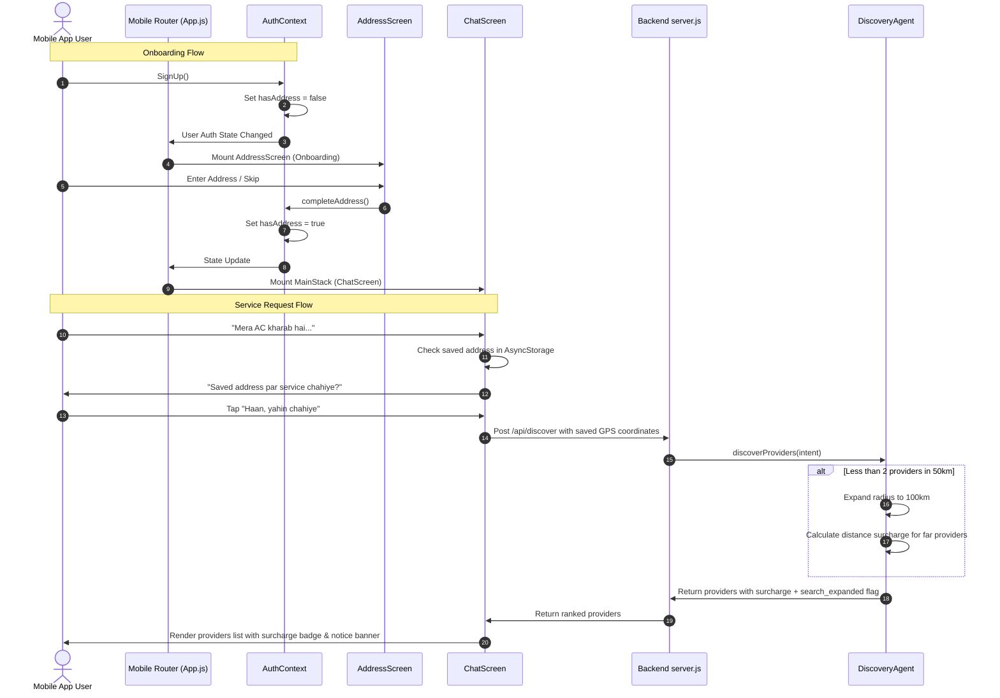

# KaamConnect Feature Upgrade Walkthrough

This document outlines the systematic implementations and modifications made across the KaamConnect mobile client and backend orchestration layers to complete the professional hackathon-grade upgrade.

---

## 🛠️ Summary of Modifications

### 1. Change 1: Post-Signup Onboarding & Navigation Flow
* **`AuthContext.js`**:
  * Added the `hasAddress` state variable initialized to `false`.
  * Updated `loadUserProfile` to set `hasAddress` to `true` only if the user profile contains a non-empty `address` or `base_location` attribute.
  * Added a `completeAddress` state action that sets `hasAddress` to `true` and saves the setting to `AsyncStorage` for persistence.
  * Updated the `signUp` routine to transition new signups directly into the onboarding state.
* **`App.js`**:
  * Re-structured the root navigation guard to route authenticated users without an address (`hasAddress === false`) exclusively to the `AddressScreen`.
* **`AddressScreen.js`**:
  * Implemented an inline, highly aesthetic onboarding welcome banner when in onboarding mode.
  * Added a **"Skip for now"** / **"Complete Onboarding"** button that invokes `completeAddress` to securely transition the user into the main application.

### 2. Change 2: Saved Address Prompt & Fallbacks in Chat Booking
* **`ChatScreen.js`**:
  * Checks for a saved user address in local storage on component mount.
  * If a saved address exists when a service booking request is initiated, the chat orchestrator posts an inline prompt asking the user if they wish to book at their saved address (`🏠 Home: Clifton, Karachi`).
  * Implemented two interactive buttons in the chat view:
    1. **"Haan, yahin chahiye" (Yes, book here)**: Instantly triggers the provider discovery agent utilizing the saved address's GPS coordinates (`latitude` / `longitude`).
    2. **"Nahi, dusri jagah" (No, use another address)**: Displays an inline address change input directly in the Chat interface to let them quickly enter a new address or redirect them to AddressScreen with a friendly button.
  * Integrated dedicated premium stylesheet tokens for the address confirmation elements.

### 3. Change 3: Expanded Search Radius & Travel Surcharge
* **`backend/src/agents/discoveryAgent.js`**:
  * Refactored the provider discovery filter logic to search within 50km first.
  * If fewer than 2 matching providers are located within 50km, it dynamically expands the search radius up to 100km.
  * For providers located beyond 50km, it calculates a distance-based travel surcharge of **PKR 100–300**:
    $$\text{Surcharge (PKR)} = \min(300, \max(100, \text{round}(\text{extraKm} \times 0.8) \times 10))$$
  * Flags distant providers with `extended_area: true` and attaches `surcharge_pkr` directly to the provider payload.
  * Returns a `search_expanded: true` flag if the expansion was triggered.
* **`backend/src/agents/matchingAgent.js`**:
  * Preserved the `extended_area` and `surcharge_pkr` properties during matching matrix compilation for both the top pick and alternative recommendations.
  * Propagated the `search_expanded` flag to the orchestrator response.
* **`ChatScreen.js`**:
  * Added a long-distance surcharge badge inside the provider card view showing `🚗 Long Distance Surcharge: +PKR X`.
  * Added an orange caution banner at the top of the provider result listing if the search radius expansion was triggered (`⚠️ Qareeb koi professional nahi mila, isliye humne search radius barha kar 100km kar diya hai.`).

---

## 📈 Architecture Overview

