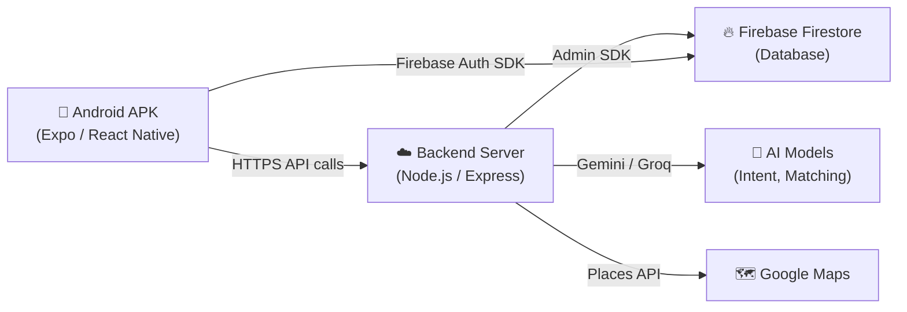

# 🚀 KaamConnect — Full Hackathon Deployment Plan

> **Goal**: Turn your local dev setup into a **shareable Android APK** backed by a **live cloud server** that any hackathon judge can install and test on their phone.

---

## Architecture Overview



**Two things need to happen:**
1. **Backend** → Deploy to a public cloud URL (so the APK can reach it over the internet)
2. **Mobile** → Build an `.apk` file using EAS Build (Expo's cloud build service)

---

## PHASE 1: Deploy Backend to the Cloud

Your backend is a standard Node.js/Express server. You need to host it somewhere with a **public HTTPS URL**.

### Option A: Railway (Recommended — Easiest) 🏆

| Step | Action |
|------|--------|
| 1 | Go to [railway.app](https://railway.app) and sign up with GitHub |
| 2 | Click **"New Project" → "Deploy from GitHub Repo"** |
| 3 | Select your repo: `Sohaib4238/KaamConnect-AI-a-service-app-` |
| 4 | Set the **Root Directory** to `backend` |
| 5 | Set the **Start Command** to `npm start` |
| 6 | Add all environment variables (see table below) |
| 7 | Deploy — Railway gives you a URL like `https://kaamconnect-backend-production.up.railway.app` |

### Option B: Render (Free Tier Available)

| Step | Action |
|------|--------|
| 1 | Go to [render.com](https://render.com) and sign up |
| 2 | Click **"New" → "Web Service"** → Connect GitHub repo |
| 3 | Set Root Directory to `backend` |
| 4 | Build Command: `npm install` |
| 5 | Start Command: `npm start` |
| 6 | Add environment variables |

### Option C: Google Cloud Run (Most Google-aligned for hackathon)

| Step | Action |
|------|--------|
| 1 | Install [Google Cloud CLI](https://cloud.google.com/sdk/docs/install) |
| 2 | Run: `gcloud init` and select project `kaamconnect-496410` |
| 3 | Create a `Dockerfile` in `backend/` (see below) |
| 4 | Run: `gcloud run deploy kaamconnect-backend --source ./backend --region asia-south1 --allow-unauthenticated` |

#### Dockerfile (if using Cloud Run)

```dockerfile
FROM node:20-slim
WORKDIR /app
COPY package*.json ./
RUN npm ci --production
COPY . .
EXPOSE 3000
ENV PORT=3000
CMD ["node", "src/server.js"]
```

### Environment Variables to Set on Your Host

> [!IMPORTANT]
> These MUST be set as environment variables on whichever platform you deploy to. Do NOT commit the `.env` file.

| Variable | Value | Where to get it |
|----------|-------|-----------------|
| `GOOGLE_CLOUD_PROJECT_ID` | `kaamconnect-496410` | Your GCP console |
| `GOOGLE_APPLICATION_CREDENTIALS` | See note below* | Service account JSON |
| `GOOGLE_MAPS_API_KEY` | Your Maps API key | GCP Console → APIs & Services |
| `FIREBASE_PROJECT_ID` | `kaamconnect-496410` | Firebase Console |
| `VERTEX_AI_LOCATION` | `asia-south1` | Your Vertex AI region |
| `GROQ_API_KEY` | Your Groq key | [console.groq.com](https://console.groq.com) |
| `PORT` | `3000` | Standard |

> [!WARNING]
> **\*Service Account JSON**: Most cloud hosts don't support file paths for credentials. You have two options:
> 1. **Railway/Render**: Create a variable called `GOOGLE_APPLICATION_CREDENTIALS_JSON` and paste the **entire contents** of `service-account.json` as the value. Then modify your backend to parse it (see code change below).
> 2. **Cloud Run**: Credentials are auto-injected — no extra config needed.

#### Backend Code Change for Cloud Hosting (Service Account)

You'll need to modify how Firebase Admin SDK initializes. Open `backend/src/config/firebase.js` (or wherever `admin.initializeApp` is called) and handle the JSON env var:

```javascript
import admin from 'firebase-admin';

let credential;
if (process.env.GOOGLE_APPLICATION_CREDENTIALS_JSON) {
  // Cloud hosting: parse JSON string from environment variable
  const serviceAccount = JSON.parse(process.env.GOOGLE_APPLICATION_CREDENTIALS_JSON);
  credential = admin.credential.cert(serviceAccount);
} else if (process.env.GOOGLE_APPLICATION_CREDENTIALS) {
  // Local dev: use file path
  const fs = await import('fs');
  const serviceAccount = JSON.parse(
    fs.readFileSync(process.env.GOOGLE_APPLICATION_CREDENTIALS, 'utf8')
  );
  credential = admin.credential.cert(serviceAccount);
}

admin.initializeApp({ credential });
export const db = admin.firestore();
```

---

## PHASE 2: Update Mobile App to Point to Live Backend

Once your backend is deployed and you have a public URL, update the mobile app.

### Step 1: Update API Base URL

Edit [api.js](file:///d:/AI%20Service%20Orchestrator%20for%20Informal%20Economy/mobile/src/config/api.js):

```diff
- const DEFAULT_URL = 'http://192.168.1.40:3000';
+ const DEFAULT_URL = 'https://your-backend-url.up.railway.app';
```

> [!CAUTION]
> Replace `your-backend-url.up.railway.app` with your ACTUAL deployed backend URL. The APK will NOT work with `localhost` or `192.168.x.x` addresses — those only work on your local Wi-Fi network.

### Step 2: Verify the Backend is Live

Before building the APK, test from your browser or terminal:

```bash
curl https://your-backend-url.up.railway.app/health
```

You should get back a JSON response with status info. If this fails, the APK won't work either.

---

## PHASE 3: Build the Android APK

Your project already has EAS Build configured in [eas.json](file:///d:/AI%20Service%20Orchestrator%20for%20Informal%20Economy/mobile/eas.json) with a `preview` profile that outputs an APK. 

### Prerequisites

| Requirement | Command to Install |
|-------------|-------------------|
| Node.js 18+ | Already installed |
| EAS CLI | `npm install -g eas-cli` |
| Expo account | Sign up at [expo.dev](https://expo.dev) |

### Step-by-Step APK Build

Open terminal in `d:\AI Service Orchestrator for Informal Economy\mobile`:

```powershell
# 1. Install EAS CLI globally (if not already)
npm install -g eas-cli

# 2. Log in to your Expo account
eas login

# 3. Configure the project for EAS (first time only)
eas build:configure

# 4. Build the APK using the "preview" profile
eas build --platform android --profile preview
```

> [!NOTE]
> - The build runs on **Expo's cloud servers** (not your machine). It takes ~10-20 minutes.
> - When done, EAS gives you a **download link** for the `.apk` file.
> - Free Expo accounts get **30 builds per month** — more than enough.

### What Your eas.json Already Has

Your existing config is already correct for APK generation:

```json
{
  "build": {
    "preview": {
      "distribution": "internal",
      "android": {
        "buildType": "apk"    // ← This is the key line!
      }
    }
  }
}
```

---

## PHASE 4: Google Sign-In Configuration for APK

> [!IMPORTANT]
> Google Sign-In requires SHA-1 fingerprint registration. Without this, login will FAIL in the built APK even though it works in Expo Go.

### Step 1: Get SHA-1 from EAS

After your first build (or before), run:

```powershell
eas credentials --platform android
```

This will show you the **SHA-1 fingerprint** of the signing key EAS used for your APK.

### Step 2: Register SHA-1 in Firebase

1. Go to [Firebase Console](https://console.firebase.google.com) → Your project (`kaamconnect-496410`)
2. Click ⚙️ **Project Settings** → **General** tab
3. Scroll to **Your apps** → Android app (`com.kaamconnect.app`)
4. Click **"Add fingerprint"** and paste the SHA-1 from Step 1
5. Download the updated `google-services.json`

### Step 3: Add google-services.json to Mobile App

Place the downloaded `google-services.json` in the `mobile/` directory and update [app.json](file:///d:/AI%20Service%20Orchestrator%20for%20Informal%20Economy/mobile/app.json):

```diff
  "android": {
    "package": "com.kaamconnect.app",
+   "googleServicesFile": "./google-services.json",
    "adaptiveIcon": {
```

### Step 4: Rebuild the APK

After adding the `google-services.json`, rebuild:

```powershell
eas build --platform android --profile preview
```

---

## PHASE 5: Testing Checklist

Before sharing the APK with judges, test every flow:

| # | Test Case | Expected Result |
|---|-----------|-----------------|
| 1 | Install APK on a phone | App opens, splash screen shows |
| 2 | Sign in with Google | Auth succeeds, lands on Onboarding Address |
| 3 | Set address | Saves and navigates to main app |
| 4 | Send "AC repair kal subah G-13 mein" in chat | AI processes, shows providers |
| 5 | Select a provider | Shows service menu |
| 6 | Select service + time | Booking confirmed with invoice card |
| 7 | Open Agent Trace tab | Shows 5-agent pipeline steps for YOUR user only |
| 8 | Check Active Requests | Shows your booking |
| 9 | Log out → Log in as different user | Agent traces are EMPTY (user isolation works) |
| 10 | Manual booking flow | Browse → Select → Checkout → Success |

---

## PHASE 6: Sharing the APK

### Option A: Direct Share (Quickest)
1. Download the `.apk` from the EAS build link
2. Upload to Google Drive / WhatsApp / Email
3. Share the link with judges — they install directly on Android

### Option B: EAS Update (OTA Updates After Install)
If you need to push quick fixes after judges install:

```powershell
# Push an over-the-air update (no new APK needed!)
npx expo install expo-updates
eas update --branch preview --message "Bug fix for hackathon demo"
```

### Option C: Internal Distribution via Expo
EAS provides a **shareable install page**. After building:
1. Go to your project on [expo.dev](https://expo.dev)
2. Click on the build → **"Install"** button
3. Share the QR code / link with judges

---

## Quick Reference: Full Command Sequence

```powershell
# ═══════════════════════════════════════
# BACKEND DEPLOYMENT (Railway example)
# ═══════════════════════════════════════

# Push latest code to GitHub first
cd "d:\AI Service Orchestrator for Informal Economy"
git add -A
git commit -m "Hackathon submission: full agentic pipeline"
git push origin main

# Then deploy via Railway dashboard (see Phase 1)

# ═══════════════════════════════════════
# MOBILE APK BUILD
# ═══════════════════════════════════════

cd "d:\AI Service Orchestrator for Informal Economy\mobile"

# Update api.js BASE_URL to your deployed backend URL first!

npm install -g eas-cli
eas login
eas build --platform android --profile preview

# Wait ~15 mins, download APK from the link EAS provides
```

---

## Common Pitfalls & Troubleshooting

| Problem | Cause | Fix |
|---------|-------|-----|
| APK shows "Network Error" | BASE_URL still points to `192.168.x.x` | Update `api.js` to your cloud URL |
| Google Sign-In fails in APK | SHA-1 not registered in Firebase | Follow Phase 4 |
| Backend crashes on Railway | Missing env variables | Double-check all 7 env vars are set |
| Firestore permission denied | Service account not configured | Ensure `GOOGLE_APPLICATION_CREDENTIALS_JSON` is set |
| EAS build fails | Missing `eas.json` or wrong Expo SDK | Already configured — run `eas build:configure` to fix |
| APK installs but shows blank screen | Metro bundler issue | Use `preview` profile (not `development`) |
| Traces show old user data | Stale client cache | Already fixed in latest code (useEffect on user change) |

---

## Files You'll Need to Modify

| File | Change | When |
|------|--------|------|
| [api.js](file:///d:/AI%20Service%20Orchestrator%20for%20Informal%20Economy/mobile/src/config/api.js) | Update `DEFAULT_URL` to cloud backend | Before APK build |
| [app.json](file:///d:/AI%20Service%20Orchestrator%20for%20Informal%20Economy/mobile/app.json) | Add `googleServicesFile` path | Before APK build |
| Backend Firebase config | Handle `GOOGLE_APPLICATION_CREDENTIALS_JSON` env var | Before cloud deploy |

---

## Summary: Order of Operations

```
1. Deploy backend to Railway/Render/Cloud Run
2. Test backend health endpoint from browser
3. Update mobile api.js with live backend URL
4. Run first EAS build to get SHA-1
5. Register SHA-1 in Firebase Console
6. Download google-services.json → add to mobile/
7. Update app.json with googleServicesFile
8. Rebuild APK with eas build --profile preview
9. Download APK → Test on phone
10. Share APK link with hackathon judges 🎉
```

> [!TIP]
> **Pro Hackathon Tip**: Keep Railway/Render running during the judging period. Free tiers may sleep after 15 mins of inactivity — add a simple health-check ping using [UptimeRobot](https://uptimerobot.com) (free) to keep it awake.
