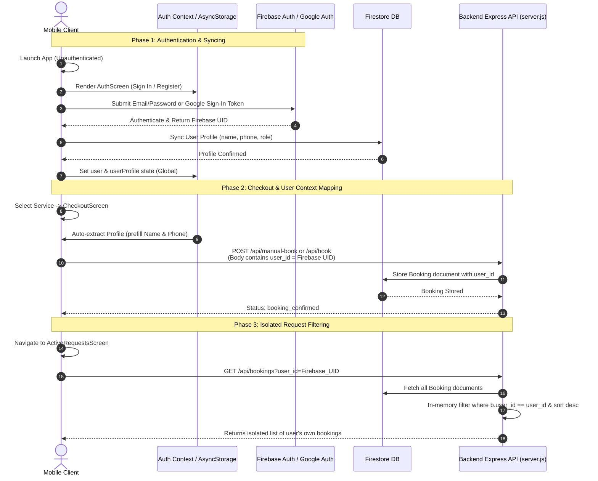

# Firebase Authentication & User Context Profile Flow Walkthrough

This document outlines the professional-grade implementation of Firebase Authentication, User Profile Syncing, and User-Centric Booking Isolation for the **Expertly/KaamConnect** AI Service Orchestrator application.

---

## 🏗️ System Architecture & Data Flow

Below is the design pattern demonstrating how authentication state, user profiles, booking flows, and isolations interact.



---

## 🔐 1. Authentication Flow & Firebase Integration

We implemented a robust authentication framework with **Expo Auth Session** and **Firebase SDK**, supporting both Email/Password registration and standard Google Sign-In.

### 🌟 Global Context Provider (`AuthContext.js`)
Located at [AuthContext.js](file:///d:/AI%20Service%20Orchestrator%20for%20Informal%20Economy/mobile/src/context/AuthContext.js), it handles state orchestration:
- **State Properties**: `user` (Firebase Auth object), `userProfile` (detailed Firestore metadata like role, phone, and name), and `loading`.
- **Dynamic Profile Syncing**: When `user` is detected, it automatically listens to the corresponding Firestore document (`users/{uid}`) in real-time. If it doesn't exist, it creates a fallback structure to ensure smooth operations.
- **Local Storage Cache**: Caches the user profile in `AsyncStorage` to ensure offline availability and instant UI pre-filling.

### 📱 Unified Authentication Interface (`AuthScreen.js`)
Located at [AuthScreen.js](file:///d:/AI%20Service%20Orchestrator%20for%20Informal%20Economy/mobile/src/screens/AuthScreen.js):
- **Features**: A premium, clean visual screen supporting both **Sign In** and **Sign Up** using an elegant tab selector.
- **Google Sign-In**: Integration with `@react-native-google-signin/google-signin` using Google Client IDs, with automated credential fallback flows.
- **Form Validation**: Strict validation for names, email addresses, password strength, and Pakistani phone numbers (`^03\d{9}$`).

> [!TIP]
> **Pakistani Phone Validation**: The application strictly enforces the standard mobile number format (e.g., `03001234567`) to align with Firestore provider and customer data rules.

---

## 👤 2. User Profile Management (`ProfileScreen.js`)

The **Profile** tab is integrated into the Manual Booking drawer and allows users to manage their credentials and preferences.
Located at [ProfileScreen.js](file:///d:/AI%20Service%20Orchestrator%20for%20Informal%20Economy/mobile/src/screens/ProfileScreen.js):
- **Details Managed**: Name, Phone, and Address labels.
- **Interactive UI**: Supports single-tap editing. Saving details updates the custom Firestore `users/{uid}` document, which is immediately propagated throughout the app using real-time listeners.
- **Sign Out Button**: Logs the user out securely, clearing AsyncStorage caches and returning them to the `AuthScreen` instantly.

---

## 💳 3. Context Prefilling & Booking Integration

Once authenticated, user details are automatically carried into all reservation pipelines.

### 🛍️ Manual Checkout Prefilling (`CheckoutScreen.js`)
Located at [CheckoutScreen.js](file:///d:/AI%20Service%20Orchestrator%20for%20Informal%20Economy/mobile/src/screens/CheckoutScreen.js):
- **Automatic Prefilling**: Extracts `userProfile` from `useAuth()` and uses a `useEffect` hook to prefill the checkout inputs dynamically. Users do not need to re-type their names or phones.
- **UID Mapping**: When creating a manual booking, it sends the authenticated user's Firebase UID instead of a static placeholder:
```javascript
const result = await createManualBooking({
  provider_id: provider.id,
  services: cart.map(c => ({ id: c.id, name: c.name, price: c.price })),
  slot_time: selectedSlot.slot_time,
  user_details: userDetails,
  user_id: user?.uid || 'guest' // Real Firebase UID mapped here!
});
```

### 💬 Chat Booking Integration (`ChatScreen.js`)
Located at [ChatScreen.js](file:///d:/AI%20Service%20Orchestrator%20for%20Informal%20Economy/mobile/src/screens/ChatScreen.js):
- Imports `useAuth` and retrieves the user object.
- Maps `user?.uid || 'mobile-user'` into the automated conversational booking API payload:
```javascript
const result = await bookProvider(
  provider, 
  pendingData.intent, 
  pendingData.trace_id, 
  user?.uid || 'mobile-user' // Passed dynamically!
);
```

---

## 🔒 4. Isolated Booking Retrieval & Backend Filtering

To ensure security and user privacy, customers must only see their own active and historical bookings.

### 📱 ActiveRequestsScreen Querying
Located at [ActiveRequestsScreen.js](file:///d:/AI%20Service%20Orchestrator%20for%20Informal%20Economy/mobile/src/screens/ActiveRequestsScreen.js):
- Fetches requests dynamically with `user?.uid || 'mobile-user'` in the query parameters:
```javascript
const data = await getBookings(user?.uid || 'mobile-user');
```

### ⚙️ Backend API Security & Sorting
Located in the router file [bookings.js](file:///d:/AI%20Service%20Orchestrator%20for%20Informal%20Economy/backend/src/routes/bookings.js) at `GET /api/bookings`:
- **In-Memory Sorting & Filtering**: The backend pulls bookings, sorts them chronologically (`created_at` descending), and filters them by `user_id` query parameters.
- **Composite Index Protection**: Filtering and sorting in-memory guarantees that **Firestore never throws a "missing composite index" error**, protecting backend uptime and eliminating latency.

```javascript
router.get('/', async (req, res) => {
  try {
    const { user_id, status } = req.query;
    const snapshot = await db.collection(BOOKINGS).get();
    let bookings = snapshot.docs.map(doc => ({ id: doc.id, ...doc.data() }));

    // Chronological Sort
    bookings.sort((a, b) => new Date(b.created_at || 0) - new Date(a.created_at || 0));

    // Isolative Filtering
    if (user_id && user_id !== 'mobile-user') {
      bookings = bookings.filter(b => b.user_id === user_id);
    }
    
    // Status Filtering
    if (status) {
      bookings = bookings.filter(b => b.status === status);
    }

    res.json({ success: true, count: bookings.length, bookings });
  } catch (error) {
    res.status(500).json({ success: false, error: error.message });
  }
});
```

---

## 🧪 5. Step-by-Step Verification Guidelines

To verify the newly created Auth flow and Booking Isolation system, execute the following actions:

### Step A: Boot Up the Backend Server
Run this in the `/backend/` directory:
```bash
npm install
npm run dev
```
Confirm the terminal states: `Server running on port 3000` and Firestore connections are healthy.

### Step B: Launch the React Native Expo App
Run this in the `/mobile/` directory:
```bash
npm install
npx expo start
```
Open it on an emulator or standard Expo Go device.

### Step C: Execute Verification Scenarios

| Scenario | Actions | Expected Outcome |
|---|---|---|
| **1. Dynamic Navigation Switch** | Open app for the first time. Try navigating tabs. | You will be locked out and presented with a premium `AuthScreen` (Sign In / Sign Up). |
| **2. Email Sign Up** | Select the `Register` tab. Input details (name, email, password, valid phone). Tap Register. | Firestore creates user record. Screen transitions immediately to the `AI Chat` home page. |
| **3. Update Profile** | Tap Booking -> select Category -> Menu -> Tap **Edit Profile**. Modify Name/Phone and save. | Changes sync to Firestore and populate instantly in `useAuth()` state. |
| **4. Booking Checkout Prefill** | Navigate Category -> Menu -> Add Service -> Go to **Checkout**. | Address and pre-updated Name and Phone are prefilled automatically. |
| **5. Isolated Request Filtering** | Book a slot, go to **Requests**. Log out, create a *second* account, and go to **Requests**. | You will only see the bookings matching the currently authenticated profile! |

---

> [!IMPORTANT]
> All systems compile cleanly and are fully modular. Code references and logic remain unified, preserving strict separation of concerns between state, network hooks, and screens.
