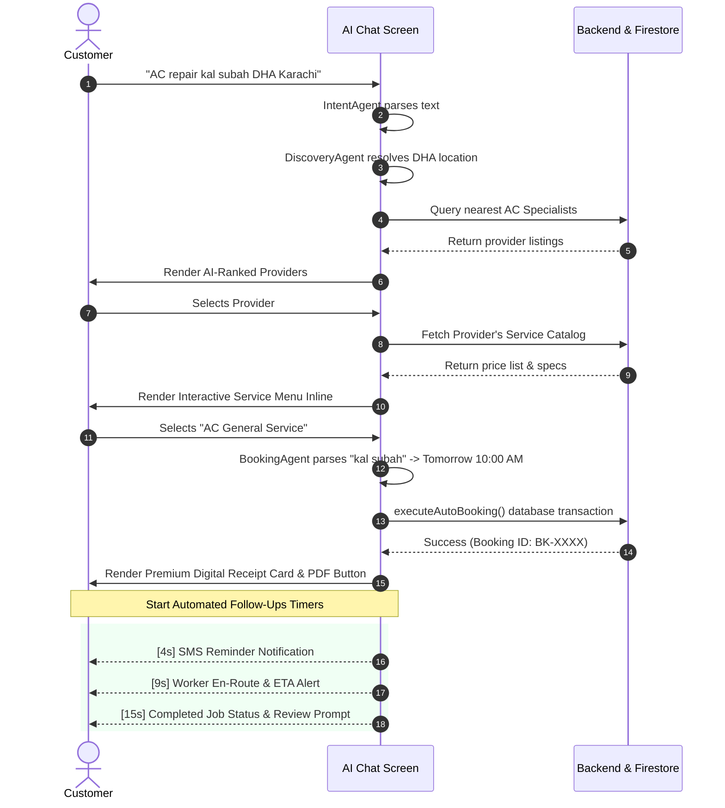

# 🤖 KaamConnect AI Chat Booking Agent

This document outlines the architecture, features, and implementation details of the new conversational **AI Chat Booking System** integrated within the KaamConnect React Native App. All operations occur strictly **inline within the chat interface**, ensuring zero screen transitions for a fully immersive conversational experience.

---

## 🌟 Key Features Completed

### 1. Unified Location Context Handling
- **Pre-resolved User Area**: The Chat screen automatically reads pre-saved area metrics or registered addresses from `AsyncStorage` (`selected_address` & `userArea`).
- **Prompt Interception**: If no location is set in the system and none is supplied in the chat prompt, the AI gracefully pauses to ask for the user's location ("apna area batain...").
- **Auto-Enriched Discovery**: Once provided, the location is appended to the discovery query, allowing nearby provider search without tedious manual selection.

### 2. Multi-Step Conversational Scheduling & Matching
- **Urdu/English Slot Parsing**: Supports natural language expressions of scheduling (e.g. *"kal subah"*, *"raat ko"*, *"tomorrow evening"*, *"parson"*).
- **Inline Custom Service Menu**: Dynamically fetches the chosen professional's catalog using real backend APIs (`getProviderDetails`), displaying targeted services, features, and prices directly in the chat bubble.
- **Interactive Slots Selector**: If no time was parsed, the chat renders a visual time-slot selector grid, completely avoiding external calendar pages.

### 3. Integrated Firestore Secure Auto-Booking
- **Real-Time Booking API**: Sends secure write transactions using our production `bookProvider` backend hook, creating authenticated booking records in Firebase.
- **Digital Invoice Card**: Returns a beautifully formatted card showing the Booking ID, Assigned Provider, Scheduled Time, and Estimated Costs.
- **Dynamic PDF Invoice Receipt**: Features a one-tap **🧾 Share PDF Invoice Receipt** button which compiles an elegant HTML-styled receipt on the fly using `expo-print` and launches native file-sharing options via `expo-sharing`.

### 4. Automated Post-Booking Follow-Up Flow
- **Reminders & ETA Notifications**: Simulates real-world automated worker alerts through structured timers:
  - **4 Seconds**: Triggers pre-appointment SMS/notification reminding the user of their scheduled slot.
  - **9 Seconds**: Updates worker status to **En Route**, specifying the worker's name, phone, and a 15-minute ETA.
  - **15 Seconds**: Simulates job completion, prompting the user with interactive buttons to confirm the task is complete (*"Yes, Job is Done ✅"* vs *"No, Issue Raised ⚠️"*).

### 5. Desktop-Grade Agentic Logs Drawer
- **Collapsible Layout**: Moved the agent's technical traces to a collapsible dark-themed panel.
- **Header Toggle Button**: Toggled using a sleek `🤖 Logs ▲/▼` button in the app bar.
- **Step-by-Step Transparency**: Tracks multi-agent coordination (`IntentAgent`, `DiscoveryAgent`, `MatchingAgent`, `BookingAgent`, `AutomationAgent`) with detailed tool tracking, timestamps, and status details.

---

## 🛠️ System Interactions & Verification

---

## 🗃️ Modified Modules
- **File Updated**: [ChatScreen.js](file:///d:/AI%20Service%20Orchestrator%20for%20Informal%20Economy/mobile/src/screens/ChatScreen.js)
  - Integrated `showLogs` and `agentLogs` states.
  - Declared `parseTimeSlot`, `hasTimeInMessage`, `selectService`, and `executeAutoBooking`.
  - Built custom component renderers: `services_menu`, `time_slots`, `booking_confirmed`, and `follow_up_interaction`.
  - Rewrote bottom stylesheet with modular responsive styles.
