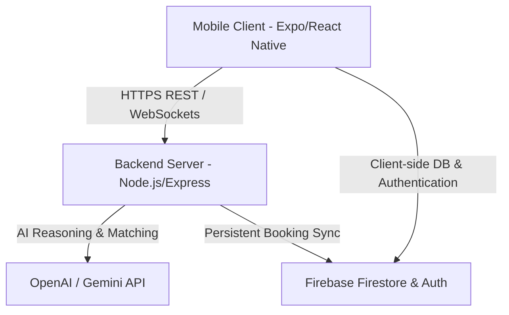

# 🚀 KaamConnect: Production Readiness & Deployment Guide

This document provides a comprehensive blueprint for launching **KaamConnect** into a production-grade environment. It covers backend service hosting, database hardening, API endpoint synchronization, mobile app compilation, and security best practices.

---

## 📂 Architecture Overview



---

## 🛠️ Step 1: Backend Server Production Deployment

The orchestrator backend handles multi-agent reasoning, intent discovery, provider matching, scheduling, and automatic reminders.

### A. Environment Variables (`.env`)
Create a production environment configuration template. **Never commit raw credentials to Git.**

| Variable | Description | Recommended Production Value |
| :--- | :--- | :--- |
| `PORT` | Web server listener port | Provided automatically by hosting platform (usually `8080` / `443`) |
| `NODE_ENV` | Mode switch | `production` |
| `BASE_URL` | Server domain endpoint | `https://api.kaamconnect.yourdomain.com` |
| `GEMINI_API_KEY` | Reasoning LLM Key | Paid Google Cloud project token |
| `FIREBASE_PROJECT_ID` | Firestore target | `kaamconnect-496410` |
| `FIREBASE_CLIENT_EMAIL` | Admin credential | service-account@kaamconnect...gserviceaccount.com |
| `FIREBASE_PRIVATE_KEY` | Admin signature | RSA private key from Firebase Console |

### B. Deployment to Render (Recommended & Free Tier Available)
1. Sign up on [Render.com](https://render.com) and link your GitHub repository.
2. Click **New +** and select **Web Service**.
3. Select your KaamConnect repository.
4. Set the following settings:
   * **Language**: `Node`
   * **Build Command**: `npm install`
   * **Start Command**: `node server.js` (or your entry point file)
5. Under the **Environment** tab, add all variables from the table above.
6. Click **Deploy Web Service**. Render will spin up a secure, auto-HTTPS-enabled Node.js server and give you a public URL (e.g., `https://kaamconnect-api.onrender.com`).

---

## 📱 Step 2: Hardening the Mobile Application

Before compiling your release binaries, configure the mobile app to point to your new production server.

### A. Switch API Configuration
Open `mobile/src/config/api.js` (or your API endpoint file) and update the backend URL to target your live Render/Railway endpoint:

```javascript
// Production Endpoint
export const BASE_URL = 'https://kaamconnect-api.onrender.com';
```

### B. Firebase Firestore Security Rules
Currently, in development mode, database rules might be set to `allow read, write: if true;`. In production, you must restrict read/writes so that users can **only** access their own profiles and bookings.

Go to the **Firebase Console** -> **Firestore Database** -> **Rules** and publish this hardened security configuration:

```javascript
rules_version = '2';
service cloud.firestore {
  match /databases/{database}/documents {
    
    // User Profiles: Users can only read/write their own document
    match /users/{userId} {
      allow read, write: if request.auth != null && request.auth.uid == userId;
    }
    
    // Bookings: Users can only read/write bookings created by themselves
    match /bookings/{bookingId} {
      allow read, write: if request.auth != null && 
        (resource == null || resource.data.userId == request.auth.uid || request.resource.data.userId == request.auth.uid);
    }
    
    // Active Requests & Status logs: Scoped to authenticated sessions
    match /active_requests/{requestId} {
      allow read, write: if request.auth != null;
    }
    
    // Providers: Publicly readable for matching, writable by admin/orchestrator only
    match /providers/{providerId} {
      allow read: if request.auth != null;
      allow write: if false; // Only manageable via Backend Admin SDK
    }
  }
}
```

---

## 📦 Step 3: Compiling Production Binaries (EAS Build)

### A. Configure App Store Meta (`app.json`)
Open `mobile/app.json` and make sure your build versioning and bundle identifiers are correctly assigned:

```json
{
  "expo": {
    "name": "KaamConnect",
    "slug": "kaamconnect",
    "version": "1.0.0",
    "orientation": "portrait",
    "icon": "./assets/logo.png",
    "userInterfaceStyle": "light",
    "splash": {
      "image": "./assets/splash.png",
      "resizeMode": "contain",
      "backgroundColor": "#ffffff"
    },
    "ios": {
      "supportsTablet": false,
      "bundleIdentifier": "com.yourname.kaamconnect"
    },
    "android": {
      "adaptiveIcon": {
        "foregroundImage": "./assets/adaptive-icon.png",
        "backgroundColor": "#ffffff"
      },
      "package": "com.yourname.kaamconnect"
    }
  }
}
```

### B. Execute App Bundle for Play Store (`.aab`)
Android App Bundles (`.aab`) are optimized packages required by the Google Play Console for listing.

Run this command in the `mobile` directory:
```bash
eas build --platform android --profile production
```
Expo will generate a highly optimized `.aab` package and sign it with your production release keystore.

### C. Execute Build for Apple App Store (`.ipa`)
*Note: Requires an Apple Developer Account.*

Run this command in the `mobile` directory:
```bash
eas build --platform ios --profile production
```
EAS will handle all code-signing certificates, provisioning profiles, and compile your release `.ipa` file.

---

## 🚦 Pre-Launch Verification Checklist

- [ ] **API Endpoint**: The mobile app is pointing to the live HTTPS URL, **not** `localhost` or local IP.
- [ ] **No Local Variables Leaks**: All hardcoded tokens in the backend have been successfully extracted into environment variables.
- [ ] **Firestore Rules Active**: Firebase rules are published and verified (tests verify that User A cannot read User B's profile).
- [ ] **Storage Swiping Validated**: The session sweeping logic has been confirmed to cleanly isolate profiles on logout.
- [ ] **Expo Release Channels**: (Optional) Configure Expo OTA (Over-The-Air) updates using `eas update` to push seamless JavaScript hotfixes directly to devices without republishing to the stores.
