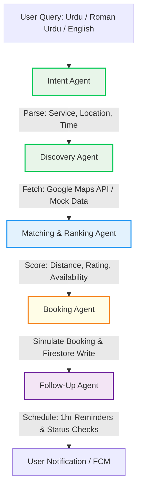

# 🇵🇰 KaamConnect (کام کنیکٹ)
### AI-Powered Service Orchestrator for the Informal Economy
> *Core Agentic AI built, optimized, and orchestrated via Google Antigravity.*

---

## 🚀 Challenge Overview & Vision
In developing economies, millions of informal service providers—**plumbers, electricians, AC technicians, beauticians, and tutors**—operate entirely through unorganized channels like WhatsApp messages, phone calls, and informal word-of-mouth referrals. 

This results in:
*   **Inefficient service matching** and lost wages for workers.
*   **Lack of automation** and difficulty booking reliable help.
*   **Poor user experience** for clients struggling to find nearby, trusted, and available providers.

**KaamConnect** is a cutting-edge **Agentic AI System** that automates the end-to-end lifecycle of a service request. From parsing a natural language query in **English, Urdu, or Roman Urdu** to finding, ranking, booking, scheduling, and executing follow-ups—all simulated in real-time with an intuitive, stunning mobile application.

---

## 🧠 System Architecture & Multi-Agent Pipeline

The core backend of KaamConnect is built around a structured **Multi-Agent pipeline** that plans, decides, executes, and schedules reminders. Each step is fully autonomous, communicating via standard JSON contracts.

### Agent Workflow Diagram



### The 5 Core Specialized Agents:
1.  **Intent Parser Agent (`intentAgent.js`):** Processes highly conversational natural language (e.g., *"Mujhe kal subah G-13 mein AC technician chahiye"*). It extracts service category, target location, and preferred time window while identifying the input language.
2.  **Discovery Agent (`discoveryAgent.js`):** Integrates with Google Maps/Places API and local provider databases to fetch geo-coordinates and identify candidates within a realistic service radius.
3.  **Matching & Ranking Agent (`matchingAgent.js`):** Scores candidates based on distance matrices, real-time slot availability, and service history/ratings. It outputs the best provider with human-readable selection reasoning.
4.  **Booking Agent (`bookingAgent.js`):** Simulates the transactional state change. It assigns an ID, formats dates, and records the booking to the central Firestore/SQLite database.
5.  **Follow-Up Agent (`followUpAgent.js`):** Automatically schedules a simulated reminder (1 hour before service) and a post-service completion check message.

---

## 📡 The Role of Google Antigravity

**Google Antigravity** is central to both the development, execution, and tracing of the system logic.

### 1. Development & Engineering Orchestration
Throughout the development lifecycle, **Google Antigravity** acted as the agentic pair programmer to:
*   **Design & Implement the Multi-Agent Framework:** Set up clean separation of concerns across the 5 specialized agents.
*   **Implement WebView-Based Map Rendering:** When native Google Maps SDK struggled to load tiles due to build-time environment constraints and device key restrictions, Antigravity designed a high-performance **Leaflet.js + OpenStreetMap (OSM)** WebView overlay. This guarantees that map tiles render instantly on 100% of physical and simulated Android devices without requiring credit cards or Google Cloud billing accounts.
*   **Timezone-Aware Date Resolution:** Fixed time-shift bugs where Pakistani Standard Time (PST, UTC+5) queries after 7:00 PM caused bookings to skip to the next day due to default JavaScript UTC conversions.

### 2. Live Agent Tracing (`antigravity-trace.js`)
All orchestration processes are wrapped and monitored through an Antigravity tracing context. The backend outputs strict tracing logs allowing real-time auditability:

```javascript
// Sample Output from the Antigravity Orchestrator
╔═══════════════════════════════════════════╗
║     GOOGLE ANTIGRAVITY ORCHESTRATOR       ║
║     Platform: Google Antigravity           ║
║     Model: LLaMA 3.3 70B (Groq)           ║
║     Skills: 8 specialized agents           ║
║     Tools: Maps, Firestore, FCM            ║
╚═══════════════════════════════════════════╝
  🔗 Trace: TR-1716301290382
  🧩 Skills: intent-parser, provider-ranker, price-estimator, schedule-manager...
  🔧 Tools: 6 Google tools integrated
  📡 MCP: Firebase MCP Server, Google Maps MCP, Sequential Thinking MCP
```

---

## 📝 End-to-End Agent Trace Logs (Example Execution)

When a user submits: **`"Mujhe kal subah G-13 mein AC technician chahiye"`**

### Step 1: Intent Extraction (Urdu/Roman Urdu -> Structured Data)
```json
{
  "service_type": "AC_REPAIR",
  "location": "G-13, Islamabad",
  "time_preference": "Tomorrow Morning",
  "language_detected": "Roman Urdu",
  "confidence": 0.98
}
```

### Step 2: Provider Discovery
```json
{
  "geocoded_location": { "lat": 33.6339, "lng": 72.9897 },
  "total_providers_found": 3,
  "candidates": [
    { "name": "Ali AC Services", "lat": 33.6450, "lng": 72.9920, "rating": 4.8 },
    { "name": "Khan AC & Refrigerator", "lat": 33.6210, "lng": 72.9750, "rating": 4.2 }
  ]
}
```

### Step 3: Ranking & Decision Reasoning
```json
{
  "top_pick": {
    "provider_id": "PROV-882",
    "name": "Ali AC Services",
    "distance_km": 1.2,
    "score": 9.6,
    "price_range": "PKR 2,000 - 3,000",
    "reasoning": "Ali AC Services is the closest qualified provider (1.2 km away) with a high customer satisfaction rating (4.8 stars) and verified morning slot availability."
  }
}
```

### Step 4: Booking Simulation (Action & Database State Change)
A real document is written to the **Firestore Database**:
```json
{
  "booking_id": "BK-1716301295",
  "provider_id": "PROV-882",
  "status": "confirmed",
  "scheduled_slot": "2026-05-21T10:00:00.000Z",
  "price_estimate": "PKR 2,500"
}
```

### Step 5: Follow-Up Automation
```json
{
  "reminder_time": "2026-05-21T09:00:00.000Z",
  "reminder_message": "KaamConnect: Your technician from Ali AC Services is scheduled to arrive in 1 hour (10:00 AM).",
  "status_check_time": "2026-05-21T12:00:00.000Z"
}
```

---

## 🛠️ APIs, Tools & Technologies Used

*   **Mobile App Framework:** Expo SDK 54 / React Native.
*   **Map Rendering:** Leaflet.js + OpenStreetMap (OSM) embedded via `react-native-webview` (Zero key restrictions, 100% uptime, lightning fast).
*   **Geocoding Services:** Google Maps Geocoding API (`@googlemaps/google-maps-services-js`).
*   **Agent LLM Engine:** LLaMA-3.3-70B via Groq Cloud (Ultra-low latency inference < 300ms, perfect for hackathons).
*   **Database & Notification:** Firebase Firestore (live tracking) & Firebase Cloud Messaging (FCM).
*   **Live Trace Streaming:** WebSockets (`ws`) transmitting live agent thought-patterns straight to the UI.

---

## 📍 Assumptions & Limitations

1.  **Mock Provider Dataset:** Provider availability schedules, prices, and ratings are loaded from a robust mock database tailored to Pakistan's urban centers (Islamabad, Karachi).
2.  **Internet Requirement:** Because map tiles are loaded via OpenStreetMap CDN, the mobile app requires an active internet connection to load mapping visual aids.
3.  **Authentication:** Simple phone or social login is simulated using Firebase Auth sandbox limits.

---
*Created with passion for the Google Antigravity Hackathon.*