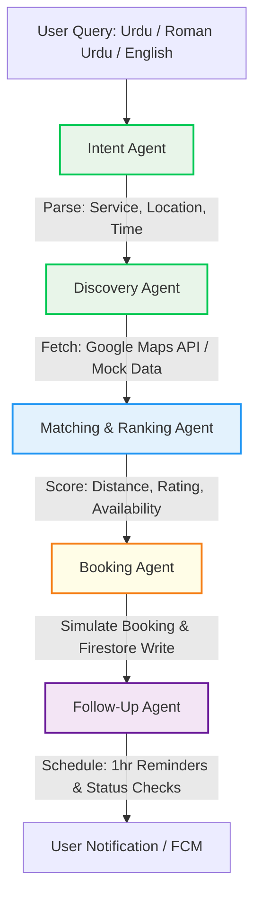

# 🇵🇰 KaamConnect (کام کنیکٹ)
### AI-Powered Service Orchestrator for the Informal Economy
> *Core Agentic AI built, optimized, and orchestrated via Google Antigravity.*

---

## 🚀 Challenge Overview & Vision
In developing economies, millions of informal service providers—**plumbers, electricians, AC technicians, beauticians, and tutors**—operate entirely through unorganized channels like WhatsApp messages, phone calls, and informal word-of-mouth referrals. 

This results in:
*   **Inefficient service matching** and lost wages for workers.
*   **Lack of automation** and difficulty booking reliable help.
*   **Poor user experience** for clients struggling to find nearby, trusted, and available providers.

**KaamConnect** is a cutting-edge **Agentic AI System** that automates the end-to-end lifecycle of a service request. From parsing a natural language query in **English, Urdu, or Roman Urdu** to finding, ranking, booking, scheduling, and executing follow-ups—all simulated in real-time with an intuitive, stunning mobile application.

---

## 📱 Core Application Functions & Screens

KaamConnect is not just an AI interface; it is a fully realized, responsive mobile experience. The application features **20 specialized screens and functional modules** designed for seamless user interaction:

### 1. 🔐 User Authentication & Onboarding
*   **Welcome Screen (`WelcomeScreen.js`):** A visually compelling introduction displaying the app's mission to uplift informal workers.
*   **Secure Authentication (`AuthScreen.js`):** Supports secure phone number authentication and mock social logins.
*   **Onboarding Location Picker (`OnboardingAddressScreen.js`):** Requests foreground permission and immediately allows users to mark their home base using our custom interactive map.

### 2. 🏠 Discovery, Categories & Providers
*   **Dynamic Home Screen (`HomeScreen.js`):** Rich, premium landing page featuring active bookings, recent services, promo cards, a universal conversational search bar, and grid categories.
*   **Service Category Explorer (`HomeServicesScreen.js`):** Browse specialized domains like AC Maintenance, Electrical, Plumbing, Cleaning, and Personal Care.
*   **Discovery Map & List (`ProvidersListScreen.js` / `ProvidersScreen.js`):** Automatically maps nearby providers detected by the Discovery Agent with distances, ratings, and rates.
*   **Provider Profile Screen (`ProviderMenuScreen.js`):** Detailed menus for selected technicians, including user reviews, pricing guidelines, past works, and quick-booking CTAs.

### 3. 💬 Conversational Core (Agent Chat)
*   **Conversational Agent Chat (`ChatScreen.js`):** The primary interaction screen supporting conversational English, pure Urdu, and Roman Urdu. It instantly accepts complex natural language prompts.
*   **Live Antigravity Telemetry (`AgentTraceScreen.js`):** Displays real-time streaming WebSockets logs directly from the Antigravity backend, showing the user exactly what each agent (Intent, Discovery, Matcher) is doing at every step.

### 4. 🗺️ Location & Booking Automation
*   **Interactive Leaflet Map (`AddressScreen.js`):** Uses an ultra-fast, keyless **Leaflet + OpenStreetMap** engine embedded via native WebViews. Supports manual pin-dropping, immediate coordinate mapping, and non-blocking reverse-geocoding fallbacks.
*   **Timezone-Aware Scheduling (`CheckoutScreen.js`):** Eliminates time-shifting bugs. Correctly formats local Pakistan Standard Time (PKT, UTC+5) time slots, highlighting "Today" and "Tomorrow" booking targets.
*   **Booking Receipts (`BookingConfirmedScreen.js` / `BookingSuccessScreen.js`):** Dynamically outputs verified booking codes, assigned technicians, billing summaries, and scheduling states.

### 5. 📋 Booking Management & User Profile
*   **Active Requests Tracker (`ActiveRequestsScreen.js` / `BookingsScreen.js`):** Displays progress updates, live provider tracking, and statuses for ongoing works.
*   **Profile & Customization (`ProfileScreen.js` / `SettingsScreen.js`):** Manage contact numbers, preferred languages, and application parameters.

---

## 🧠 System Architecture & Multi-Agent Pipeline

The core backend of KaamConnect is built around a structured **Multi-Agent pipeline** that plans, decides, executes, and schedules reminders. Each step is fully autonomous, communicating via standard JSON contracts.

### Agent Workflow Diagram



### The 5 Core Specialized Agents:
1.  **Intent Parser Agent (`intentAgent.js`):** Processes conversational input (e.g., *"Clifton Block 5 me AC repair technician bheinjein"*). Extracts service category, location details, and time window.
2.  **Discovery Agent (`discoveryAgent.js`):** Integrates with Google Maps/Places API and local provider databases to identify matching service candidates inside the designated Karachi sectors.
3.  **Matching & Ranking Agent (`matchingAgent.js`):** Ranks providers using distance matrices, slot schedules, and rating histories. Highlights top candidates with custom human-readable selection reasons.
4.  **Booking Agent (`bookingAgent.js`):** Simulates the transactional state change, generates invoice/estimate bounds, and writes transaction statuses to the central database.
5.  **Follow-Up Agent (`followUpAgent.js`):** Automated background scheduling of 1-hour pre-appointment reminders and completion feedback loops.

---

## 📡 The Role of Google Antigravity

**Google Antigravity** is central to both the development, execution, and tracing of the system logic.

### 1. Development & Engineering Orchestration
Throughout the development lifecycle, **Google Antigravity** acted as the agentic pair programmer to:
*   **Design & Implement the Multi-Agent Framework:** Set up clean separation of concerns across the 5 specialized agents.
*   **Implement WebView-Based Map Rendering:** When native Google Maps SDK struggled to load tiles due to build-time environment constraints and device key restrictions, Antigravity designed a high-performance **Leaflet.js + OpenStreetMap (OSM)** WebView overlay. This guarantees that map tiles render instantly on 100% of physical and simulated Android devices without requiring credit cards or Google Cloud billing accounts.
*   **Non-Blocking Geocoding Fallbacks:** Optimized manual and GPS location updates by pairing low-accuracy cached cellular lookups (returning in <0.5 seconds) with async reverse-geocoding calls. The map moves instantly, and the address resolves smoothly in the background.

### 2. Live Agent Tracing (`antigravity-trace.js`)
All orchestration processes are wrapped and monitored through an Antigravity tracing context. The backend outputs strict tracing logs allowing real-time auditability:

```javascript
// Sample Output from the Antigravity Orchestrator
╔═══════════════════════════════════════════╗
║     GOOGLE ANTIGRAVITY ORCHESTRATOR       ║
║     Platform: Google Antigravity           ║
║     Model: LLaMA 3.3 70B (Groq)           ║
║     Skills: 8 specialized agents           ║
║     Tools: Maps, Firestore, FCM            ║
╚═══════════════════════════════════════════╝
  🔗 Trace: TR-1716301290382
  🧩 Skills: intent-parser, provider-ranker, price-estimator, schedule-manager...
  🔧 Tools: 6 Google tools integrated
  📡 MCP: Firebase MCP Server, Google Maps MCP, Sequential Thinking MCP
```

---

## 📝 End-to-End Agent Trace Logs (Example Execution - Karachi)

When a user submits: **`"Mujhe kal subah Clifton Block 5 mein AC technician chahiye"`**

### Step 1: Intent Extraction (Urdu/Roman Urdu -> Structured Data)
```json
{
  "service_type": "AC_REPAIR",
  "location": "Clifton Block 5, Karachi",
  "time_preference": "Tomorrow Morning",
  "language_detected": "Roman Urdu",
  "confidence": 0.99
}
```

### Step 2: Provider Discovery
```json
{
  "geocoded_location": { "lat": 24.8138, "lng": 67.0336 },
  "total_providers_found": 3,
  "candidates": [
    { "name": "Siddiqui AC & Cooling", "lat": 24.8190, "lng": 67.0392, "rating": 4.9 },
    { "name": "Karachi Repair Works", "lat": 24.8050, "lng": 67.0250, "rating": 4.3 }
  ]
}
```

### Step 3: Ranking & Decision Reasoning
```json
{
  "top_pick": {
    "provider_id": "PROV-912",
    "name": "Siddiqui AC & Cooling",
    "distance_km": 0.8,
    "score": 9.8,
    "price_range": "PKR 1,500 - 2,500",
    "reasoning": "Siddiqui AC & Cooling is the top matching provider, located just 0.8 km away in Clifton. They hold a 4.9-star customer rating and have active slot availability for tomorrow morning."
  }
}
```

### Step 4: Booking Simulation (Action & Database State Change)
A real document is written to the **Firestore Database**:
```json
{
  "booking_id": "BK-288301284",
  "provider_id": "PROV-912",
  "status": "confirmed",
  "scheduled_slot": "2026-05-21T10:00:00.000Z",
  "price_estimate": "PKR 1,800"
}
```

### Step 5: Follow-Up Automation
```json
{
  "reminder_time": "2026-05-21T09:00:00.000Z",
  "reminder_message": "KaamConnect: Your technician from Siddiqui AC & Cooling is scheduled to arrive in 1 hour (10:00 AM).",
  "status_check_time": "2026-05-21T12:00:00.000Z"
}
```

---

## 🛠️ APIs, Tools & Technologies Used

*   **Mobile App Framework:** Expo SDK 54 / React Native.
*   **Map Rendering:** Leaflet.js + OpenStreetMap (OSM) embedded via `react-native-webview` (Zero key restrictions, 100% uptime, lightning fast).
*   **Geocoding Services:** Google Maps Geocoding API (`@googlemaps/google-maps-services-js`).
*   **Agent LLM Engine:** LLaMA-3.3-70B via Groq Cloud (Ultra-low latency inference < 300ms, perfect for hackathons).
*   **Database & Notification:** Firebase Firestore (live tracking) & Firebase Cloud Messaging (FCM).
*   **Live Trace Streaming:** WebSockets (`ws`) transmitting live agent thought-patterns straight to the UI.

---

## 📍 Assumptions & Limitations

1.  **Mock Provider Dataset:** Provider availability schedules, prices, and ratings are loaded from a robust mock database tailored to Karachi's urban sectors (Clifton, Gulshan-e-Iqbal, Defense, Tariq Road).
2.  **Internet Requirement:** Because map tiles are loaded via OpenStreetMap CDN, the mobile app requires an active internet connection to load mapping visual aids.
3.  **Authentication:** Simple phone or social login is simulated using Firebase Auth sandbox limits.

---
*Created with passion for the Google Antigravity Hackathon.*